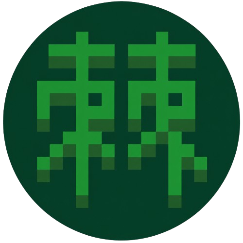

# toge
  
**toge** is an experimental, developing, new programming language, that, being honest here, is made for myself, I and me. '-'  
It has a not-so-conventional syntax, and doesn't follow as many rules as other languages, but that's ok. :)  

For example, many keywords are turned into functions. -_-  
`let` is turned into `vrb()`,   
`return` is turned into `ret()`,  
`function` into `newf()`...   
You get the point. :|  

Anyway and anywho, you can learn it, you can use it, you can see how it grows, it doesn't bother me.  
Even if you don't think it's cool, that's ok, it wasn't made to be a revolutionary secret weapon as competition towards other languages.  
It's just a few little quirks added up to make sense to me. :]  

Goodbye, and have a great day! :D  
